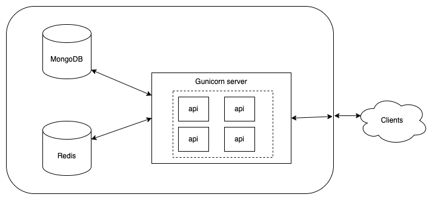

# ABAC System

---

## Table of content:
* [First time installation](#first-time-installation)
* [Backend architecture design](#backend-architecture-design)
* [Other approach](#other-approach-that-i-thought-about)

---

## First time installation
* Make sure to have Python 3.11 installed (https://www.python.org/downloads/)
* Install `poetry` with `pip3 install poetry`

After cloning the repository, run the following command from the source root:
```
docker compose -f compose.yaml up --build -d
```
* and thats it :) you have a running cluster on your docker machine
* check out swagger UI at: http://0.0.0.0:9876/api/doc (I provided only 3 enpoints example due to time constraints)

---

## Backend architecture design




Why I chose MongoDB:
* Since all of our queries will be by some id, I thought its best to choose mongo (it provides efficient built in index on `_id`)
* Also as of scale, mongoDB can be scaled to handle tens of thousands of requests per second, we can just scale the replica set

Why I chose Redis:
* Its a caching layer on top of mongoDB which serves in memory reads and writes.
* Which make it capable also of scaling to tens of thousands of requests per second, also it can be deployed as cluster
* My cache is key-to-value cache, its simple logic

Why I chose Gunicorn deployment ?
* Basically the python micro services handle requests using 1 core/process, so I wanted to efficiently use the cores in the hosted machine,
so the Gunicorn server are deployed with `(number of cpus * 2) + 1`
* What we get is that each `api` pod (assuming we are going to deploy it using Kubernetes) to use as many as cores in the hosting machine.
* In case we want to scale we can configure autoscaling for the api component as much as we need
* And ofcourse we can add a `nginx` load balancer on top of that


* `api` component is implemented on top of `aiohttp`, its a lightweight and super fast framework 
* There is a health check call that happens each 15 seconds (can be configured in Dockerfile) which simply pings MongoDB and Redis to make sure they're up and running

---

### Inside MongoDB:

* 4 collections: `attributes`, `users`, `policies`, `resources`
* Each collection has an `_id` corresponding to the documents, and the schema is just like in the assignment pdf
* I made sure each access to the database is using `_id` so mongodb can use its index on it
* Which the provided requirements numbers (1000 attributes, 10,000 users etc..) the `_id` index will be fit in RAM memory which will give us a performance boost.
* MongoDB can handle these numbers easily

---

### Inside Redis:

* 2 caches: the first one is `attributes cache` which holds the attributes (names+types) in memory, since we have many writes and on each write we have to validate the data being written according to the attributes definitions, its best that we hold this list in memory and to not make a db query on each write for it.
the second cache is `conditions cache` which holds the conditions by policy_id key, this is a crucial part of the is_authorized logic, so I chose to save it in memory for the sake of the performace
* the 2 caches above is being invalidated when some of its keys changes, and it will be loaded upon the next read call for it

---

### Unit tests:

run:
```
poetry run pytest
```
--- 

### Load tests:

* I would have added a load test to the system, just to make sure it fulfill the requirements

--- 

## Other approach that I thought about

I thought about caching the final results instead of calculating it in memory on each request, example for the cache will be:
```
(user_id, resource_id) -> True/False
```
on first API call, if the result is not in the cache then the service will calculate it and save only the result to the cache.
The complication here is that on each policy/user/resource update the cache needs to be cleared in two directions:
* if the user is updated then all records for this user_id needs to be cleared (for all resources)
* if the resource is updated then all records for this resource_id needs to be cleared (for all users)
* if the policy is updated then all records that are attached to this policy_id needs to be cleared (for all users and for all resources)

So holding a simple key/value cache in the above way won't work
and another reason for that is we have 10000 users x 100000 resources, the redis will work hard to clear and maintain this cache

Thats why I preferred to cache only the crucial parts in the code which responsible for doing the calculation as much as fast as it can in memory.


